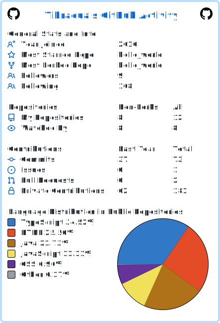

## Hi there 👋
# This is Tihraqua Alhussein
- ⏳ 5+ years of experience in Software Testing.
- 🏆 Certified: ISTQB-FL, ISTQB-MAT
- 🌱 I’m currently learning Playwright and JS
- 📫 For free to contact me on [email](mailto:tihraquamahdi@gmail.com)

 

 

ISTQB® certified Software Quality Assurance and Application Tester with over 6 years of experience in the fintech, telecom,
government, and insurance industries. Proficient in systems integration testing, API testing, and regression testing, with a solid
understanding of software test design and testing methodologies and hands-on experience testing mobile applications, web
applications, and DB testing. Demonstrated expertise in creating test plans, test cases, and scripts, and a strong background in
performance testing using JMETER and automation testing using Selenium Webdriver and Appium with JAVA. Familiar with
Agile/Scrum development methodologies and version control systems. Excellent numeracy, analytical, and troubleshooting skills.

- ## Skills and Technologies

- # Programming languages:
  
- # Test Automation:
  
- # CICD:
     
- # Frameworks:
 TestNG
- # Technologies:
  

  ---------------------------------------------------------------------------------------------------------------------------

<h2>📊 Profile stats</h2>

  

------------------------------------------------------------------------------------------------------------------------------------------------------------------------------------------------  

  <h2>🎉 My open source projects</h2>

 

  
  

